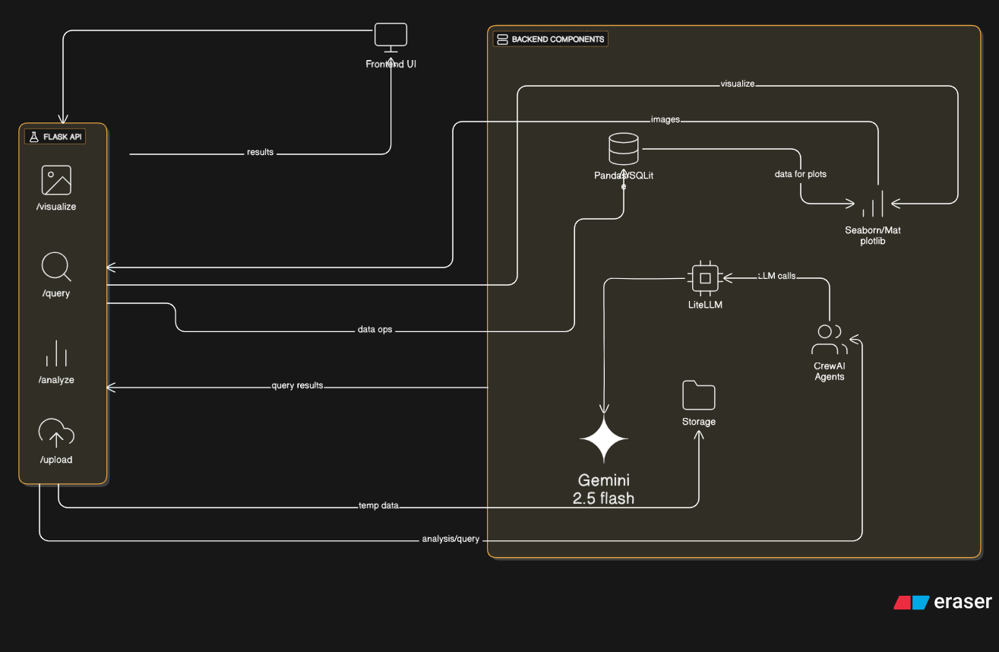

# DataDetective (NLPtoSQL)

AI-powered data analysis platform for tabular datasets with a modern React frontend and a Flask + CrewAI backend.

Demo video:
https://drive.google.com/file/d/14_jPRpqQGWFD4E2rwbhciZgBhhRAaFF3/view?usp=sharing

<p align="center">
    
</p>

Figure: High-level architecture of DataDetective.

## 1. What This Project Does

DataDetective lets you upload a dataset and then interact with it through five workflows:

1. Dashboard profiling (schema, quality, missing values, outliers, correlations)
2. Deep AI analysis (executive EDA report)
3. Natural language query to SQL to narrative insight
4. Smart interactive visualization generation
5. Detective mode for anomaly and forensic-style investigation

It is designed for business users, analysts, and developers who want fast insight generation without manually writing SQL and plotting code.

## 2. Current Tech Stack

Frontend:

- React 19 + Vite 7
- Tailwind CSS 4
- Lucide icons
- React Markdown
- Plotly (runtime CDN load)

Backend:

- Flask 3 + Flask-CORS
- CrewAI 0.55
- LangChain ChatLiteLLM
- LiteLLM (OpenRouter routing)
- Pandas, NumPy, SciPy
- Plotly + Kaleido
- SQLite (in-memory for query execution)

LLM Routing:

- Primary model: `openrouter/deepseek/deepseek-chat-v3-0324`
- Fallback model: `openrouter/openai/gpt-4o-mini`
- Param compatibility safeguard: `litellm.drop_params = True`

## 3. Repository Structure

```text
NLPtoSQL/
├─ architecture
├─ architecture.png
├─ ReadMe.md
├─ package.json
├─ crewai_agents/
│  ├─ app.py
│  ├─ agents.py               # legacy/alternate module (not main runtime entrypoint)
│  ├─ requirements.txt
│  ├─ .env
│  ├─ uploads/                # persisted uploaded datasets
│  └─ venv/                   # local virtual environment (if used)
└─ frontend/
     ├─ package.json
     ├─ index.html
     ├─ vite.config.js
     ├─ src/
     │  ├─ App.jsx              # current primary UI implementation
     │  ├─ index.css
     │  ├─ App.css
     │  ├─ main.jsx
     │  ├─ components/          # older componentized UI artifacts
     │  └─ services/
     │     └─ apiService.js
     └─ dist/                   # production build output
```

## 4. End-to-End Runtime Flow

1. User uploads file in frontend upload view.
2. Frontend sends multipart request to `POST /upload`.
3. Backend reads source file (CSV/TSV/XLSX/SQL), normalizes to DataFrame, stores a generated dataset CSV under `crewai_agents/uploads/`.
4. Backend returns `dataset_id` + computed profile object.
5. User switches among tabs and runs features:
- Analysis tab calls `POST /analyze`.
- Query tab calls `POST /query`.
- Visualize tab calls `POST /visualize`.
- Detective tab calls `POST /detective`.
6. Frontend keeps tab responses in state and now preserves them while switching tabs.
7. Frontend also stores active dataset context in localStorage (`nlptosql_active_dataset`) so reloading can recover the active session context.
8. Clicking "New Dataset" triggers `POST /cleanup` and resets the app to upload mode.

## 5. Core Features (Current Behavior)

Dataset Upload & Profiling:

- Supports `.csv`, `.tsv`, `.xlsx`, `.sql`
- Returns shape, dtypes, missing values, duplicate stats, correlation hints, outlier analysis, and sample rows

Analysis:

- CrewAI Data Profiler agent generates markdown report with:
- Executive summary
- Data quality
- Statistical insights
- Key findings
- Recommendations

Query (NL to SQL):

- Query Interpreter agent produces structured intent JSON
- SQL Craftsman agent generates safe SELECT-only SQLite SQL
- Insight Narrator summarizes query result in plain language
- Optional result chart generated dynamically

Visualize:

- Plotly charts generated from dataset semantics
- AI chart-specific insight and key finding enrichment
- Interactive chart rendering in frontend

Detective Mode:

- Computes forensic stats (z-score outliers, high cardinality, structured missingness, near-duplicates)
- Generates "case file" markdown via agent
- Returns forensic chart set

UI/UX Reliability:

- Markdown fence unwrapping and payload sanitization for malformed LLM markdown
- Overflow-safe markdown/table/code rendering
- API online/offline status badge
- Tab state preserved across tab switches until dataset reset

## 6. API Reference

Base URL:

- Local default: `http://localhost:5000`

### `GET /health`

Purpose:

- Service health probe

Success response (example):

```json
{
    "status": "ok",
    "version": "2.0.0",
    "engine": "DataDetective"
}
```

### `POST /upload`

Purpose:

- Upload and register a dataset

Request:

- `multipart/form-data`
- field: `file`

Success response (shape):

```json
{
    "success": true,
    "dataset_id": "temp_dataset_<uuid>.csv",
    "profile": {
        "shape": { "rows": 0, "columns": 0 },
        "columns": [],
        "dtypes": {},
        "numeric_columns": [],
        "categorical_columns": [],
        "datetime_columns": [],
        "missing": {},
        "numeric_summary": {},
        "outlier_analysis": {},
        "distribution_stats": {},
        "top_correlations": [],
        "categorical_summaries": {},
        "duplicate_rows": { "count": 0, "percent": 0 },
        "sample_rows": []
    }
}
```

### `POST /analyze`

Purpose:

- Generate AI EDA report for uploaded dataset

Request:

```json
{ "dataset_id": "temp_dataset_<uuid>.csv" }
```

Response:

```json
{
    "success": true,
    "analysis": "<markdown>",
    "profile": { "...": "..." }
}
```

### `POST /query`

Purpose:

- Convert natural language question into SQL and insights

Request:

```json
{
    "dataset_id": "temp_dataset_<uuid>.csv",
    "query": "What are top 10 stores by weekly sales?"
}
```

Response (shape):

```json
{
    "success": true,
    "interpretation": {
        "valid": true,
        "interpreted_intent": "...",
        "required_columns": [],
        "analysis_type": "ranking",
        "suggestion": "...",
        "confidence": 0.0
    },
    "sql_query": "SELECT ...",
    "result": {
        "data": [],
        "columns": [],
        "row_count": 0
    },
    "narrative": "...",
    "result_chart": { "data": [], "layout": {} }
}
```

### `POST /visualize`

Purpose:

- Build chart set and AI chart commentary

Request:

```json
{ "dataset_id": "temp_dataset_<uuid>.csv" }
```

Response (shape):

```json
{
    "success": true,
    "charts": [
        {
            "chart_type": "histogram",
            "title": "...",
            "description": "...",
            "insight": "...",
            "key_finding": "...",
            "plotly_json": { "data": [], "layout": {} }
        }
    ]
}
```

### `POST /detective`

Purpose:

- Run forensic/anomaly analysis with case-file output

Request:

```json
{ "dataset_id": "temp_dataset_<uuid>.csv" }
```

Response (shape):

```json
{
    "success": true,
    "case_file": "<markdown>",
    "forensics": { "...": "..." },
    "forensic_charts": [
        {
            "title": "...",
            "plotly_json": { "data": [], "layout": {} }
        }
    ]
}
```

### `POST /cleanup`

Purpose:

- Delete stored uploaded dataset and clear session artifact by `dataset_id`

Request:

```json
{ "dataset_id": "temp_dataset_<uuid>.csv" }
```

Response:

```json
{ "success": true }
```

## 7. Setup and Run (Local)

Prerequisites:

- Python 3.10+ (3.11 recommended for package compatibility)
- Node.js 18+
- npm 9+

### Backend (Flask + CrewAI)

1. Go to backend folder:

```bash
cd crewai_agents
```

2. Create and activate a virtual environment:

Windows PowerShell:

```bash
python -m venv venv
.\venv\Scripts\Activate.ps1
```

macOS/Linux:

```bash
python -m venv venv
source venv/bin/activate
```

3. Install dependencies:

```bash
pip install -r requirements.txt
```

4. Create `.env` in `crewai_agents/`:

```env
OPENROUTER_API_KEY=your_openrouter_api_key_here
```

5. Run backend:

```bash
python app.py
```

Backend default:

- `http://127.0.0.1:5000`

### Frontend (React + Vite)

1. Open frontend folder:

```bash
cd frontend
```

2. Install dependencies:

```bash
npm install
```

3. Optional frontend `.env`:

```env
VITE_API_BASE_URL=http://localhost:5000
```

4. Run development server:

```bash
npm run dev
```

5. Production build:

```bash
npm run build
npm run preview
```

## 8. Important Runtime Notes

Dataset lifecycle:

- Upload creates `dataset_id` and stores CSV in `crewai_agents/uploads/`
- All feature endpoints consume `dataset_id`
- Cleanup removes dataset storage entry

State persistence:

- Active dataset context is stored under `nlptosql_active_dataset`
- Tab responses persist while switching tabs (components remain mounted)
- Full reset occurs only when user triggers New Dataset (and cleanup)

Markdown safety:

- Backend markdown may include fenced wrappers
- Frontend sanitizes API payload and unwraps markdown fences
- Rendering includes overflow guards for long tokens/tables/code blocks

## 9. Troubleshooting

`AttributeError: 'OpenRouterLLM' object has no attribute 'bind'`:

- Cause: custom LLM object incompatible with CrewAI runnable expectations
- Fix in current code: backend uses `ChatLiteLLM` + `.with_fallbacks(...)`

`litellm.UnsupportedParamsError ... openrouter does not support parameters ...`:

- Cause: unsupported parameters passed through LiteLLM/OpenRouter combo
- Fix in current code: `litellm.drop_params = True`

`WinError 32 ... file is being used by another process` during upload:

- Cause: temp file lock behavior on Windows
- Fix in current code: `mkstemp + os.close(fd) + safe_unlink(...)` retry cleanup

Frontend overflow/one-line markdown artifacts:

- Cause: malformed fenced markdown or very long unbroken content
- Fix in current code: payload sanitization + markdown unwrapping + overflow-safe CSS

## 10. Scripts Quick Reference

Frontend (`frontend/package.json`):

- `npm run dev`
- `npm run build`
- `npm run preview`
- `npm run lint`

Backend:

- `python app.py`

## 11. Security and Query Safety

Query generation protections include:

- SQL constrained to `SELECT`/`WITH`
- Explicit blacklist of mutating commands (`insert`, `update`, `delete`, `drop`, etc.)
- In-memory SQLite execution only
- Result limits for generated queries

Still recommended:

- Add auth/rate limiting for public deployment
- Add request size limits for large uploads
- Add audit logging around prompt and query execution in production

## 12. Current Project Status

This README reflects the current implementation centered on:

- `crewai_agents/app.py` as backend entrypoint
- `frontend/src/App.jsx` as frontend primary UI

Some additional files exist as legacy or alternate implementations and are not part of the primary runtime path.